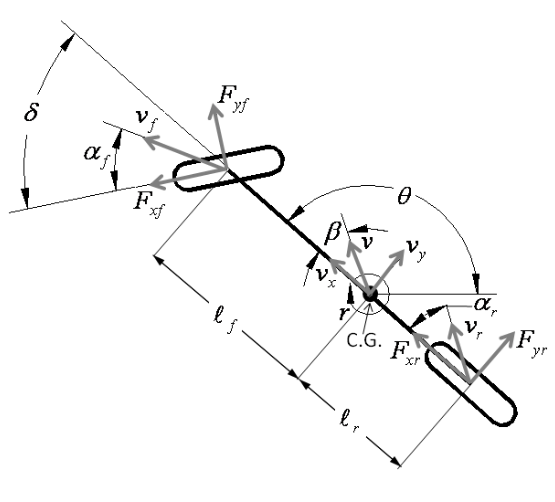

# Non-linear Vehicle Model and Linear MPC Controller in Autoware

## Overview
This project involves the development and analysis of a non-linear vehicle model and a Model Predictive Control (MPC) framework implemented within the **Autoware** autonomous driving platform. The primary focus is on dynamic modeling, control system design, and simulation analysis for precise lateral control in autonomous vehicles.

## Abstract
This report presents the development and analysis of a non-linear vehicle model and a Model Predictive Control (MPC) framework implemented within the **Autoware** autonomous driving platform. The study focuses on dynamic modeling, control system design, and simulation analysis to achieve precise lateral control in autonomous vehicles.

The vehicle dynamics are represented by two complementary models. A non-linear vehicle model, incorporating tire forces and slip angles, is implemented on the simulation side to mimic real-world nonlinearities. For the controller, a linearized state-space model derived from the vehicle dynamics is used, enabling the design of an MPC framework suitable for real-time applications.

The MPC controller employs bilinear discretization to ensure dynamic feasibility while minimizing a quadratic cost function for trajectory tracking and control effort. Simulations are conducted to analyze the interaction between the non-linear simulation model and the linearized control system, highlighting the importance of accurate modeling for robust control design in autonomous driving scenarios.

## Dynamic Modeling
This section presents the mathematical formulations for the linear and non-linear vehicle models utilized in the project.

The equation of motion considering forces in the lateral direction is given as:

$$
F_{yf} \cos(\delta) - F_{xf} \sin(\delta) + F_{yr} = m (\dot{v}_y + v_x r)
$$

Considering motion in the plane, a center of gravity (C.G.) along the centerline of the vehicle, and yaw inertia \( I_z \), the yaw moment balance gives:

$$
\ell_f (F_{yf} \cos(\delta)) - \ell_r (F_{yr} - F_{xf} \sin(\delta)) = I_z \dot{r}
$$

where \( r \) is the angular rate about the yaw axis.

Without the constraint on lateral slip, the slip angles of the tires are given as:

$$
\alpha_f = \tan^{-1} \left( \frac{v_y + \ell_f r}{v_x} \right) - \delta, \quad
\alpha_r = \tan^{-1} \left( \frac{v_y - \ell_r r}{v_x} \right).
$$

Modeling the force generated by the wheels as linearly proportional to the slip angle, the lateral forces are defined as:

$$
F_{yf} = -2c_f \alpha_f, \quad
F_{yr} = -2c_r \alpha_r
$$

Assuming a constant longitudinal velocity, \( \dot{v}_x = 0 \), allows the simplification:

$$
F_{xf} = 0
$$

Substituting Eqs. (5) and (6) into Eqs. (1) and (2), and solving for \( \dot{v}_y \) and \( \dot{r} \), we get:

$$
\dot{v}_y = \frac{-2c_f \left[\tan^{-1} \left( \frac{v_y + \ell_f r}{v_x} \right) - \delta\right] \cos(\delta) - 2c_r \tan^{-1} \left( \frac{v_y - \ell_r r}{v_x} \right)}{m} - v_x r
$$

$$
\dot{r} = \frac{-\ell_f c_f \left[\tan^{-1} \left( \frac{v_y + \ell_f r}{v_x} \right)-\delta\right] \cos(\delta) + \ell_r c_r \tan^{-1} \left( \frac{v_y - \ell_r r}{v_x} \right)}{I_z}
$$

This gives the **dynamic bicycle model**.

Key parameters include:
- **Tire Cornering Stiffness (\(c_f, c_r\))**: Front and Rear tire cornering stiffness.
- **Vehicle Mass and Inertia (\(m, I_z\))**: Distributed between front and rear axles.
- **Wheelbase (\(l_f, l_r\))**: Distance from Center of gravity to axles.
- **Steer (\(\delta\))**: Steering angle.
- **Slip Angles (\(\alpha_f,\alpha_r\))**: Front and rear slip angles respectively.
- **Velocities (\(\mathbf{v}_y, \mathbf{v}_x\))**: Lateral and Longitudinal Velocities.
- **Tire Forces (\(\mathbf{F}_{yf}, \mathbf{F}_{yr}\))**: Front and Rear tire forces.

### Linearized Dynamic Bicycle Model
To apply linear control methods to the dynamic bicycle model, the model must be linearized. Applying small-angle assumptions to Eqs. (8) and (9) gives:

$$
\dot{v}_y = \frac{-2c_f v_y - 2c_f \ell_f r}{m v_x} + \frac{2c_f \delta}{m} + \frac{-2c_r v_y + 2c_r \ell_r r}{m v_x} - v_x r
$$

$$
\dot{r} = \frac{-2\ell_f c_f v_y - 2\ell_f^2 c_f r }{I_z v_x} + \frac{2\ell_f c_f \delta}{I_z} + \frac{2\ell_r c_r v_y - 2\ell_r^2 c_r r}{I_z v_x}
$$

Collecting terms, the linearized equations become:

$$
\dot{v}_y = \frac{-(2c_f + 2c_r)}{m v_x} v_y + \left[\frac{2l_rc_r-2l_fc_f}{mv_x}-v_x \right]r + \frac{2c_f}{m} \delta
$$

$$
\dot{r} = \frac{2\ell_r c_r - 2\ell_f c_f}{I_z v_x} v_y + \frac{-(2\ell_f^2 c_f + 2\ell_r^2 c_r)}{I_z v_x} r + \frac{2\ell_f c_f}{I_z} \delta
$$

This represents the **linearized dynamic bicycle model**.

### Linear Vehicle Model in Path Coordinates

As with the kinematic bicycle model, it is useful to express the dynamic bicycle model with respect to the path.  
With the constant longitudinal velocity assumption, the yaw rate derived from the path \( r(s) \) is defined as:

$$
r(s) = \kappa(s) v_x
$$

The path-derived lateral acceleration \( \dot{v}_y(s) \) follows as:

$$
\dot{v}_y(s) = \kappa(s) v_x^2
$$

Letting \( e_{\text{cg}} \) be the orthogonal distance of the C.G. to the path, we have:

$$
\ddot{e}_{\text{cg}} = (\dot{v}_y + v_x r) - \dot{v}_y(s)
= \dot{v}_y + v_x (r - r(s))
= \dot{v}_y + v_x \dot{\theta}_e
$$

$$
\dot{e}_{\text{cg}} = v_y + v_x \sin(\theta_e)
$$

where \( \theta_e \) is defined as \( \theta - \theta_p(s) \). Substituting \( (e_{\text{cg}}, \theta_p) \) into Eqs. (12) and (13) and the state-space model in tracking error variables is therefore given by:

$$
\begin{bmatrix}
\dot{e}_{\text{cg}} \\
\ddot{e}_{\text{cg}} \\
\dot{\theta}_e \\
\ddot{\theta}_e
\end{bmatrix} = 
\begin{bmatrix}
0 & 1 & 0 & 0 \\
0 & -\frac{2c_f + 2c_r}{m \cdot v_x} & \frac{2c_f + 2c_r}{m} & \frac{2l_r \cdot c_r - 2l_f \cdot c_f}{m \cdot v_x} \\
0 & 0 & 0 & 1 \\
0 & \frac{2l_r \cdot c_r - 2l_f \cdot c_f}{I_z \cdot v_x} & \frac{2l_f \cdot c_f - 2l_r \cdot c_r}{I_z} & -\frac{2l_f^2 \cdot c_f + 2l_r^2 \cdot c_r}{I_z \cdot v_x}
\end{bmatrix}
\begin{bmatrix}
e_{\text{cg}} \\
\dot{e}_{\text{cg}} \\
\theta_e \\
\dot{\theta}_e
\end{bmatrix}
+
\begin{bmatrix}
0 \\
\frac{2c_f}{m} \\
0 \\
\frac{2l_f \cdot c_f}{I_z}
\end{bmatrix}
\delta
+
\begin{bmatrix}
0 \\
\frac{2l_r \cdot c_r - 2l_f \cdot c_f}{m \cdot v_x} - v_x \\
0 \\
-\frac{2l_f^2 \cdot c_f + 2l_r^2 \cdot c_r}{I_z \cdot v_x}
\end{bmatrix}
r(s)
$$

The linearized dynamic model in path coordinates is now ready for control application.
