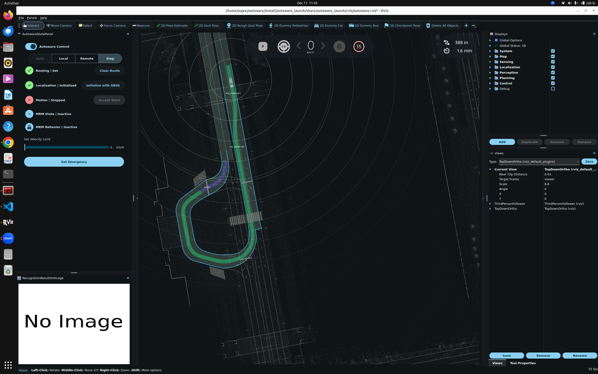
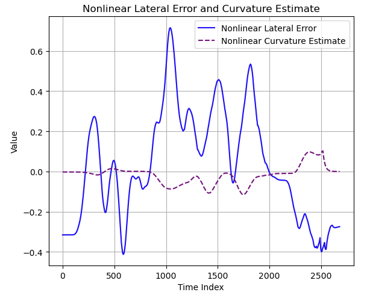
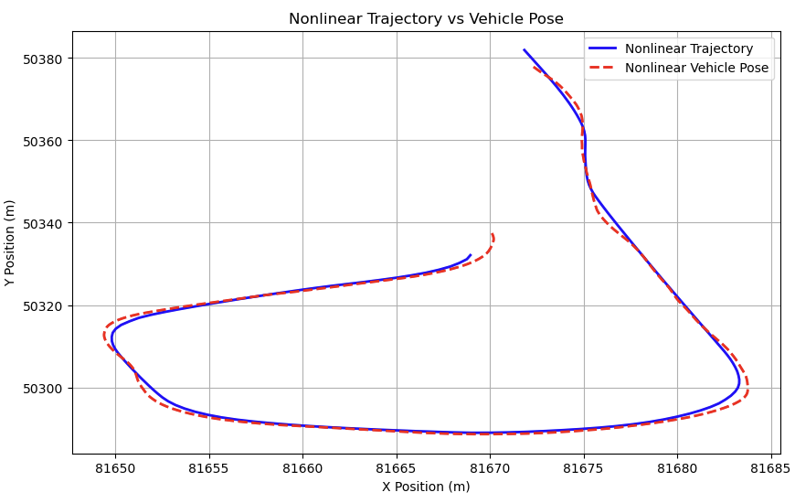
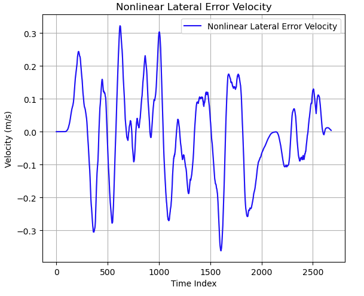
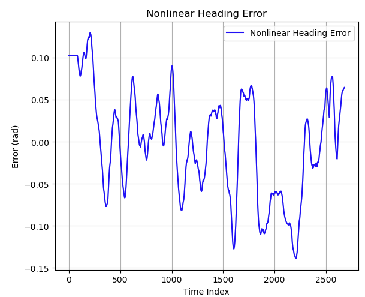
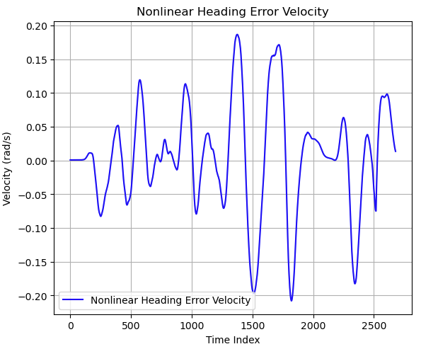
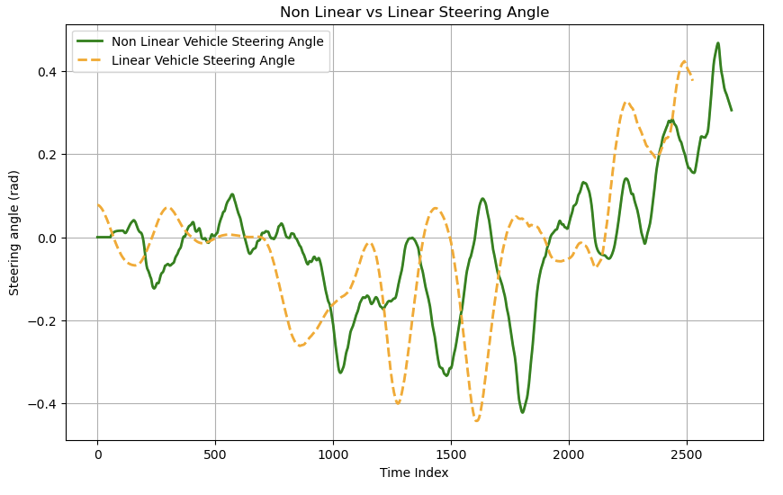

# Abstract

This report presents the evaluation and comparison of linear and non-linear vehicle models within the Autoware framework for Model Predictive Control (MPC) in autonomous vehicles. The primary focus is on lateral control and trajectory tracking performance under various dynamic conditions. Both models were tested for their ability to handle lane changes, circular path navigation, and steering responses. The results show that the non-linear model outperforms the linear model, especially in terms of real-world vehicle dynamics, such as tire forces and slip angles. The non-linear MPC controller demonstrates superior resilience to disturbances and system uncertainties, making it more applicable for autonomous vehicle systems. The findings highlight the importance of simulating realistic vehicle dynamics to ensure the robustness and efficiency of control systems in dynamic and unstructured environments.

# Simulation Results and Analysis

The simulation results aim to evaluate the performance of the system under various conditions using both linear and non-linear vehicle models. These results provide insights into the vehicle's lateral dynamics, trajectory tracking, and steering responses, emphasizing the accuracy and stability of the control system. Each subsection focuses on specific aspects of the vehicle's behavior during the simulation.

## Map Overview

The simulation environment, shown in Figure 7, includes scenarios that involve both lane changes and navigating around a circular path. These diverse scenarios are used to evaluate the control system’s ability to handle complex driving tasks. 

*Figure 7: Map*

The layout tests the vehicle's trajectory-following capability and dynamic stability as it adapts to various turns and maneuvers, providing a comprehensive assessment of the control system's performance under different driving conditions.

## Lateral Error and Curvature

Figure 8 shows the lateral error (\(e_{\text{cg}}\)) and curvature values over time. This plot illustrates the tracking performance and curvature adherence of the vehicle during simulation. As we can see, as the curvature changes from \(\kappa=0\) to non-zero values, the error increases and the maximum error reaches 0.7m. However, the control system remains robust, quickly correcting the vehicle’s trajectory and bringing it back on track within a fraction of a second as the curvature changes.

*Figure 8: Lateral error and curvature over time.*

## Trajectory Tracking and Error Metrics

Figure 9 compares the vehicle's planned trajectory with its actual pose. The error is most noticeable at the curve entry and exit points. The motion planning algorithm generates the trajectory from the start to the goal pose, while the odometry sensor provides the vehicle's position in the Frenet frame. This data is plotted on the same graph to highlight the path deviation during the simulation.

*Figure 9: Trajectory tracking and error metrics.*

## Lateral Error Velocity and Heading Metrics

Figures 10, 11, and 12 show the lateral error velocity (\(\dot{e_{\text{cg}}}\)), heading error (\(\theta_{\text{e}}\)), and heading error velocity (\(\dot{\theta_{\text{e}}}\)) over time. These values are derived from the state equations used in the model. As observed, the absolute heading error reaches a maximum of 0.3 radians, primarily during the curve entry and exit phases, which is a typical scenario in trajectory tracking.

*Figure 10: Lateral error velocity over time.*

*Figure 11: Heading error over time.*

*Figure 12: Heading error velocity over time.*

## Tire Angle Comparison

The comparison of tire angle response between the linear and non-linear vehicle models, shown in Figure 13, reveals that while the time delay between tire angles is minimal in both models, the non-linear model exhibits more steering noise. This results in less smooth steering compared to the linear model, which shows a more stable response with fewer fluctuations.

*Figure 13: Comparison of tire angles between linear and non-linear models.*

# Conclusion

This report demonstrates the implementation and evaluation of both linear and non-linear vehicle models for Model Predictive Control (MPC) within the Autoware platform, with a focus on lateral control for autonomous vehicles. The key findings include:

- **Superior Performance of Non-Linear Model:** The non-linear model consistently outperformed the linear model, especially in handling dynamic vehicle behaviors, such as tire forces and slip angles, resulting in more accurate trajectory tracking.
- **MPC Robustness:** Both linear and non-linear MPC controllers demonstrated robustness to disturbances and system uncertainties, although the non-linear MPC showed superior resilience in more complex scenarios.
- **Real-World Applicability:** The non-linear model's ability to closely simulate real-world vehicle dynamics makes it more suitable for deployment in autonomous driving systems, where handling real-world complexities is essential.

In future work, additional research into adaptive MPC controllers and further tuning of the vehicle dynamics could enhance the robustness and efficiency of the control system, particularly in highly dynamic or unstructured environments.

# References

1. Jeon, W., Chakrabarty, A., Zemouche, A., & Rajamani, R. (2021). Simultaneous state estimation and tire model learning for autonomous vehicle applications. *IEEE/ASME Transactions on Mechatronics*, 26(4), 1941-1950.
2. Snider, J. M. (2009). Automatic steering methods for autonomous automobile path tracking. Robotics Institute, Pittsburgh, PA, Tech. Rep. CMU-RITR-09-08.
3. Funke, J., Brown, M., Erlien, S. M., & Gerdes, J. C. (2016). Collision avoidance and stabilization for autonomous vehicles in emergency scenarios. *IEEE Transactions on Control Systems Technology*, 25(4), 1204-1216.
4. [Autoware Control Design](https://autowarefoundation.github.io/autoware-documentation/main/design/autoware-interfaces/components/control/)
5. [Autoware Vehicle Model](https://autowarefoundation.github.io/autoware-documentation/main/how-to-guides/integrating-autoware/creating-vehicle-and-sensor-model/creating-vehicle-model/)

# Appendix: ROS, Autoware, and Vehicle Simulation Details

## ROS and Autoware Integration

Robot Operating System (ROS) serves as the backbone for Autoware, providing the middleware needed for efficient communication between various components of an autonomous vehicle system. Autoware utilizes ROS to handle tasks such as message passing, sensor integration, and modular development of software packages. By leveraging ROS, Autoware can seamlessly connect perception, planning, and control modules.

## RViz and Vehicle Coordinates in Simulation

RViz is a visualization tool within ROS that allows users to interactively view data from the autonomous vehicle in both real-time and simulation environments. In the context of Autoware, RViz is used to display the vehicle's trajectory, sensor data, and pose in a simulated or real-world coordinate frame. This visualization provides critical insights into the vehicle's behavior and its planned trajectory.

Vehicle coordinates within RViz are derived from the state provided by the non-linear vehicle model and the planned trajectory. The following equations demonstrate how the coordinates \(X\) and \(Y\) are calculated.

## Coordinate Calculation

The desired trajectory \(X_{\text{des}}\) and \(Y_{\text{des}}\) are computed from the path planning module, which provides a time-dependent trajectory. The equations below outline how the actual coordinates \(X\) and \(Y\) are determined using the non-linear vehicle model's output:

