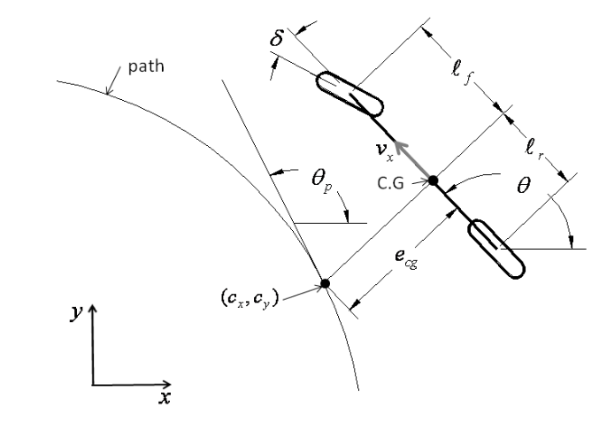

# Non-linear Vehicle Model and Linear MPC Controller in Autoware

This repository contains the report and associated materials for the project titled **Non-linear Vehicle Model and Linear MPC Controller in Autoware**, authored by Sujeendra Ramesh. The project focuses on developing a dynamic vehicle model and a Model Predictive Control (MPC) framework implemented in the Autoware autonomous driving platform.

## Table of Contents
1. [Abstract](#abstract)
2. [Dynamic Modeling](#dynamic-modeling)
    - [Non-linear Vehicle Model](#non-linear-vehicle-model)
    - [Linearized Dynamic Bicycle Model](#linearized-dynamic-bicycle-model)
    - [Path Coordinate Representation](#linear-vehicle-model-in-path-coordinates)
3. [Images](#images)

---

## Abstract

This project report presents:
- A **non-linear vehicle model** that incorporates realistic tire forces and slip angles for simulation.
- A **linearized state-space model**, suitable for real-time control applications, for use in Model Predictive Control (MPC).
- An MPC controller that employs bilinear discretization to predict and track desired trajectories while minimizing control effort.

The study highlights the interaction between the nonlinear simulation model and the linearized control system, underlining the importance of accurate modeling for robust control in autonomous vehicles.

---

## Dynamic Modeling

### Non-linear Vehicle Model

The non-linear vehicle model integrates tire forces and lateral slip angles, representing real-world dynamics more accurately. Key equations include:

1. **Lateral Force Dynamics**:
   \[
   F_{yf} \cos(\delta) - F_{xf} \sin(\delta) + F_{yr} = m (\dot{v}_y + v_x r).
   \]

2. **Yaw Dynamics**:
   \[
   \ell_f (F_{yf} \cos(\delta)) - \ell_r (F_{yr} - F_{xf} \sin(\delta)) = I_z \dot{r}.
   \]

3. **Slip Angles**:
   \[
   \alpha_f = \tan^{-1} \left( \frac{v_y + \ell_f r}{v_x} \right) - \delta, \quad
   \alpha_r = \tan^{-1} \left( \frac{v_y - \ell_r r}{v_x} \right).
   \]

For a more detailed breakdown, refer to the [dynamic model](#images) images.

---

### Linearized Dynamic Bicycle Model

The linearization of the vehicle model simplifies it for control methods like MPC:
- **State Equations**:
   \[
   \dot{x} = A x + B u + W
   \]
   Where \(x\) represents the state vector, \(u\) is the input (e.g., steering angle), and \(W\) incorporates curvature-dependent terms.

- **Discretization**:
   \[
   A_d = (I - 0.5 \Delta t A)^{-1} (I + 0.5 \Delta t A), \quad
   B_d = ((I - 0.5 \Delta t A)^{-1} \Delta t) B
   \]

---

### Linear Vehicle Model in Path Coordinates

To enhance tracking, the dynamic vehicle model is expressed relative to the path:
\[
\begin{bmatrix}
\dot{e}_{\text{cg}} \\
\ddot{e}_{\text{cg}} \\
\dot{\theta}_e \\
\ddot{\theta}_e
\end{bmatrix} = A x + B u + W.
\]
The state matrix \(A\) and input matrix \(B\) are computed based on path curvature and system dynamics.

---

## Images

### Dynamic Model

### Path Coordinates Representation

---

## Author

**Sujeendra Ramesh**  
Email: [rames154@umn.edu](mailto:rames154@umn.edu)

This project is part of ME 8285 at the University of Minnesota.

---

## License

Include any applicable license for the project here (e.g., MIT, GPL, etc.).

---

## Acknowledgments

This work builds on the Autoware autonomous driving platform and focuses on robust vehicle modeling and control system design.

